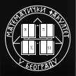

# Razvoj softvera - Matematički fakultet

## Nastavno osoblje
- Predavanja
    - [Saša Malkov](http://poincare.matf.bg.ac.rs/~smalkov/)
- Vežbe
    - [Nemanja Mićović](http://poincare.matf.bg.ac.rs/~nemanja_micovic)
    - [Nikola Ajzenhamer](http://poincare.matf.bg.ac.rs/~nikola_ajzenhamer/)

## Plan vežbi po temama

Gradivo za kolokvijum:

1. Uvod u C++. Strukture podataka u standardnoj biblioteci.
1. OOP u jeziku C++. UML dijagrami klasa.
1. Memorijski model objekata na hip memoriji.
1. Generičke funkcije.
1. Algoritmi standardne biblioteke.
1. Nasleđivanje, višestruko nasleđivanje, enumi, operatori.

Gradivo za ispit (podrazumeva se poznavanje gradiva sa kolokvijuma):

1. Biblioteka Qt5 za kreiranje grafičkih korisničkih interfejsa.
1. Funkcionalno programiranje u jeziku C++.
1. Testiranje programa. Biblioteka `Catch2`.
1. Programiranje višenitnih aplikacija pomoću biblioteke Qt5. 
1. Serijalizacija i deserijalizacija podataka pomoću biblioteke Qt5.

- [Zadaci za vežbanje gradiva za ispit](https://www.overleaf.com/read/fhgnxmjjdxdt). Ovi zadaci služe isključivo za vežbanje gradiva sa časova vežbi. Ne pretpostaviti da će obim ili forma zadataka odgovarati zadacima na ispitu.

Dodatne teme koje se ne proveravaju na testovima:

1. Qt5 grafička scena.
1. Odabrane teme iz C++17.
1. CMake sistem za prevođenje C++ projekata.

## Bodovanje
- Predispitne obaveze
    - Praktično-teorijski kolokvijum
        - 25 poena
    - Timski projekat
        - 20 poena
- Završni ispit
    - Praktično-teorijski deo
        - 40 poena
    - Usmeni deo
        - 15 poena

## Projekti

- Implementacioni jezik: C++
- Nisu dozvoljene baze podataka
- Timovi su od 3 člana
- Studenti sami formiraju timove i biraju temu
    - Asistent treba da vam odobri temu usmeno ili putem mejla
- Dozvoljeno je i dati doprinos projektima otvorenog koda
    - U tom slučaju, možete da radite sami
- Obavezno korišćenje alata `git`
- Prijava se vrši putem Google formulara koji će biti okačen naknadno
- Pre prijavljivanja, neophodno je da svaki član tima:
    - Ima svoj nalog na servisu `GitHub`
    - Zna osnove korišćenja sistema `git`
    - Zna osnove korišćenja servisa `GitHub`

### Repozitorijum

- Za svaki tim će biti kreiran GitHub repozitorijum na kojem će biti verzionisan izvorni kod
- Svi projekti moraju biti završeni i odbranjeni do početka prvog ispitnog roka

### Izveštaji

- Na nedeljnom nivou
- Nose određen broj poena na projektu
- Objavljuju se na Wiki stranici GitHub repozitorijuma
- Svaki izveštaj mora da sadrži sledeće podatke:
    - Informacije o tome šta je urađeno tokom prethodne sedmice
    - Plan za narednu sedmicu
    - Snimak ekrana trenutnog stanja programa

## Očekivanja od studenata

- Samostalno istraživanje i redovno učenje
    - Preporučeni delovi iz literature i članci
    - Domaći zadaci
- Aktivno istraživanje rešenja problema tokom rada na projektu
    - Dokumentacija
    - StackOverflow i sl.
- Redovno praćenje obaveštenja
    - Sajtovi profesora i asistenata
- Ankete za prijavljivanje povodom izlaska na kolokvijum ili ispit
    - Student se prijavljuje na anketu **samo ako sa velikom verovatnoćom** izlazi na proveru znanja
    - U slučaju da se student prijavi na anketu, a u međuvremenu ipak odustane, OBAVEZNO je javiti se asistentu putem mejla
    - Ovime nam drastično olakšavate organizaciju ispita
